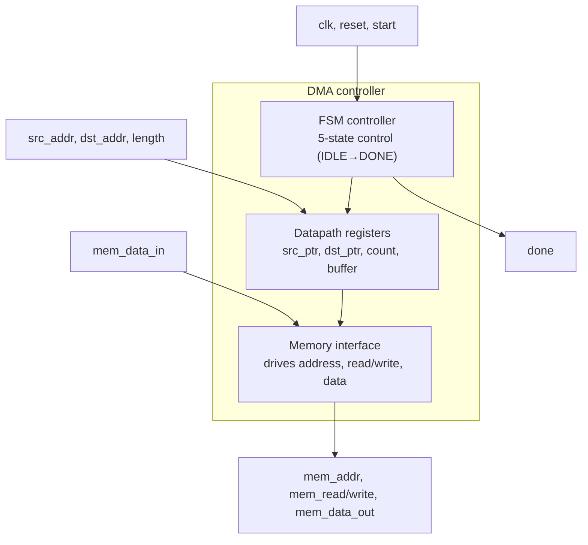

# Implementation-and-RTL-Design-of-DMA-Controller-using-Verilog-in-Xilinx-ISE-14.7  & Spartan-6 FPGA Implementation

<p align="center">

  
  
  
  
  

</p>

## Overview

This project implements a **single-channel Direct Memory Access (DMA) controller** in synthesizable Verilog HDL.

The DMA controller autonomously transfers a programmable block of **8-bit data between source and destination memory locations**, reducing the need for CPU intervention during the actual transfer.

The controller is built around a **5-state finite state machine (FSM)**:

```text
IDLE → READ → READ_WAIT → WRITE → READ → ... → DONE → IDLE
```
The design supports programmable:

* Source address
* Destination address
* Transfer length
* Start control
* Memory read/write control
* Transfer completion indication

The RTL was functionally verified using a self-checking Verilog testbench with a behavioral 512-byte memory model, simulated using Xilinx ISim, and synthesized/timed for a Xilinx Spartan-6 FPGA using Xilinx XST.

### Key Results

| Parameter                            |               Result |
| ------------------------------------ | -------------------: |
| Data width                           |                8-bit |
| Address width                        |               16-bit |
| Maximum programmable transfer length |         65,535 bytes |
| FSM states                           |                    5 |
| Clock frequency achieved             |        **237.7 MHz** |
| Minimum clock period                 |         **4.207 ns** |
| Slice Registers                      |  **92 / 4,800 (1%)** |
| Slice LUTs                           | **142 / 2,400 (5%)** |
| Bonded IOBs                          |   **86 / 102 (84%)** |
| Synthesis errors                     |                **0** |
| Synthesis warnings                   |                **0** |
| Functional verification              |             **PASS** |

## Project Objectives
The main objectives of this project are:
* Design a synthesizable DMA controller using Verilog HDL.
* Implement memory-to-memory data transfer without CPU intervention during the transfer.
* Develop an FSM-based control architecture for sequencing memory read and write operations.
* Support programmable source address, destination address, and transfer length.
* Verify the RTL using a self-checking testbench.
* Analyze synthesis results and FPGA resource utilization.
* Perform static timing analysis and identify the critical timing path.
* Demonstrate a complete RTL → Simulation → Synthesis → Timing Analysis flow.

## The Reports and Screenshots of this project are present above :
```text
reports
screenshots
```
##  DMA Architecture


| Signal          | Direction | Width |
|------------------|-----------|:-----:|
| `clk`            | Input     | 1     |
| `reset`          | Input     | 1     |
| `start`          | Input     | 1     |
| `src_addr`       | Input     | 16    |
| `dst_addr`       | Input     | 16    |
| `length`         | Input     | 16    |
| `mem_data_in`    | Input     | 8     |
| `mem_addr`       | Output    | 16    |
| `mem_data_out`   | Output    | 8     |
| `mem_read`       | Output    | 1     |
| `mem_write`      | Output    | 1     |
| `done`           | Output    | 1     |


The DMA controller operates between a control interface and a shared memory interface.
The CPU or external controller programs the transfer parameters:
```text
src_addr
dst_addr
length
```
and then generates a start pulse.
Once started, the DMA controller internally maintains source and destination pointers and performs the transfer autonomously.
```text
                         CONTROL INTERFACE
                             
                  ┌─────────────────────────┐
                  │                         │
       start ────►│                         │
     src_addr ───►│                         │
     dst_addr ───►│     DMA CONTROLLER      │
       length ───►│                         │
                  │        5-State FSM      │
                  │                         │
                  └───────────┬─────────────┘
                              │
             ┌────────────────┼─────────────────┐
             │                │                 │
             ▼                ▼                 ▼
        mem_addr[15:0]    mem_read          mem_write
             ▲                                   │
             │                                   ▼
      mem_data_in[7:0]                     mem_data_out[7:0]
                                                 |
                                                 ▼
                                                done

                             
```

# Architecture Highlights
The controller contains:

* A 16-bit source pointer
* A 16-bit destination pointer
* A 16-bit transfer counter
* An 8-bit temporary data buffer
* A 3-bit FSM state register
* Registered memory control outputs
* A one-cycle done completion pulse

.# Internal Datapath
The RTL contains four major datapath registers.
# Source Pointer
```text
reg [15:0] src_ptr;
```
Stores the current source memory address.
After every successful write operation:
```text
src_ptr <= src_ptr + 16'd1;
```
Therefore, the source address automatically advances by one byte per transfer.

# Destination Pointer
```text
reg [15:0] dst_ptr;
```
Stores the current destination memory address.
It is incremented after each byte transfer:
```text
dst_ptr <= dst_ptr + 16'd1;
```
# Transfer Counter
```text
reg [15:0] count;
```
Stores the number of bytes remaining.
It is initialized from the programmable length input:
```text
count <= length;
```
and decremented after each write:
```text
count <= count - 16'd1;
```
The final transfer is detected using:
```text
if(count == 16'd1)
    state <= DONE;
```
# Data Buffer
```text
reg [7:0] data_buffer;
```
Stores the data returned from memory during the read phase.
The data is captured in the READ_WAIT state:
```text
data_buffer <= mem_data_in;
```
The buffered data is subsequently driven onto mem_data_out during the WRITE state.
This separates the memory-read phase from the memory-write phase and models a one-cycle read

## FSM Control Architecture
The DMA controller uses a 5-state Moore-style control FSM.

```text
                    start
                      │
                      ▼
                 ┌─────────┐
                 │  IDLE   │
                 └────┬────┘
                      │
                      ▼
                 ┌─────────┐
                 │  READ   │
                 └────┬────┘
                      │
                      ▼
              ┌───────────────┐
              │   READ_WAIT   │
              └───────┬───────┘
                      │
                      ▼
                 ┌─────────┐
                 │  WRITE  │
                 └────┬────┘
                      │
              ┌───────┴────────┐
              │                │
        count == 1         count != 1
              │                │
              ▼                ▼
         ┌─────────┐      ┌─────────┐
         │  DONE   │      │  READ   │
         └────┬────┘      └─────────┘
              │
              ▼
           ┌──────┐
           │ IDLE │
           └──────┘
```
### FSM state Table

| State       | Encoding | Function                                                                                     |
| ----------- | -------- | -------------------------------------------------------------------------------------------- |
| `IDLE`      | `000`    | Waits for `start` and loads source, destination and transfer length                          |
| `READ`      | `001`    | Places source pointer on memory address bus and asserts `mem_read`                           |
| `READ_WAIT` | `010`    | Captures memory data into `data_buffer`                                                      |
| `WRITE`     | `011`    | Places destination address and buffered data on the memory interface and asserts `mem_write` |
| `DONE`      | `100`    | Generates a one-cycle `done` pulse and returns to `IDLE`                                     |

 ## State-by-State Operation
# IDLE
The controller remains in IDLE until start is asserted.
When start = 1, the DMA captures the programmed transfer parameters:
```text
src_ptr <= src_addr;
dst_ptr <= dst_addr;
count   <= length;
state   <= READ;
```
This creates a snapshot of the transfer configuration.
After this point, the source and destination pointers are controlled internally by the DMA.

# READ
The current source address is placed on the memory interface:
```text
mem_addr <= src_ptr;
mem_read <= 1'b1;
```
The controller then advances to READ_WAIT.

# READ_WAIT
The memory data is captured:
```text
data_buffer <= mem_data_in;
```
The controller then moves to the WRITE state.
This intermediate state provides a clean separation between the memory read and memory write operations.

# WRITE
The destination address and buffered data are presented to the memory:
```text
mem_addr     <= dst_ptr;
mem_data_out <= data_buffer;
mem_write    <= 1'b1;
```
At the same time, the internal pointers and transfer counter are updated:
```text
src_ptr <= src_ptr + 16'd1;
dst_ptr <= dst_ptr + 16'd1;
count   <= count - 16'd1;
```
If the current transfer is the final byte:
```text
if(count == 16'd1)
    state <= DONE;
```
Otherwise, the controller returns to READ.

# DONE
The DMA generates a completion pulse:
```text
done <= 1'b1;
```
and returns to IDLE on the following cycle.
The done signal therefore acts as a simple transfer-completion handshake.

## Transfer Timing
Each byte transfer passes through three functional phases:
```text
READ → READ_WAIT → WRITE
```
Therefore, the design requires approximately:
```text
3 clock cycles / byte
```
For an N-byte transfer:
```text
Total cycles = 1 + 3N + 1
```
where:
* 1 cycle is used to latch the transfer parameters in IDLE
* 3N cycles perform the byte transfers
* 1 cycle is used by DONE

For the 4-byte verification test:
```text
Total cycles = 1 + (3 × 4) + 1
             = 14 clock cycles
```
This matches the implemented FSM sequence.

At the synthesized maximum frequency:
```text
Fmax = 237.713 MHz

Clock period = 4.207 ns
```
The theoretical byte-transfer interval is approximately:
```text
3 × 4.207 ns ≈ 12.62 ns / byte
```
corresponding to an effective transfer rate of approximately:
```text
≈ 79 MB/s
```
for continuous data movement, excluding system-level bus overhead.

## RTL Interface

### DMA Module Ports
| Port           | Direction | Width | Description                         |
| -------------- | --------- | ----: | ----------------------------------- |
| `clk`          | Input     |     1 | System clock                        |
| `reset`        | Input     |     1 | Asynchronous active-high reset      |
| `start`        | Input     |     1 | Starts a DMA transfer               |
| `src_addr`     | Input     |    16 | Source starting address             |
| `dst_addr`     | Input     |    16 | Destination starting address        |
| `length`       | Input     |    16 | Number of bytes to transfer         |
| `mem_data_in`  | Input     |     8 | Data returned from memory           |
| `mem_data_out` | Output    |     8 | Data written to memory              |
| `mem_addr`     | Output    |    16 | Current memory address              |
| `mem_read`     | Output    |     1 | Memory read control                 |
| `mem_write`    | Output    |     1 | Memory write control                |
| `done`         | Output    |     1 | One-cycle transfer completion pulse |

## Reset and Control Behavior
The controller uses an asynchronous active-high reset:
```text
always @(posedge clk or posedge reset)
```
When reset = 1, all control signals and internal registers are initialized.

The FSM returns to:
```text
IDLE
```
and the memory interface is disabled:
```text
mem_read  = 0
mem_write = 0
done      = 0
```
The internal pointers, counter, data buffer, address and output data are also cleared.

## Verification Environment
The design was verified using a dedicated self-checking Verilog testbench:
```text
DMA_TB.v
```
The testbench models a simple 512-byte memory:
```text
reg [7:0] mem [0:511];
```
The memory is connected directly to the DMA interface.

# Memory Read Model
```text
assign mem_data_in = mem[mem_addr];
```
# Memory Write Model
```text
always @(posedge clk)
begin
    if(mem_write)
        mem[mem_addr] <= mem_data_out;
end
```
This creates a simple behavioral memory environment for functional verification.

### Verification Test Case

The testbench uses the following transfer configuration:
| Parameter           | Value         |
| ------------------- | ------------- |
| Source address      | `0x0000`      |
| Destination address | `0x0100`      |
| Transfer length     | 4 bytes       |
| Source data         | `AA BB CC DD` |
| Clock period        | 10 ns         |
| Clock frequency     | 100 MHz       |

### Initial Memory Contents
Address       Data
-------------------
0x0000        AA
0x0001        BB
0x0002        CC
0x0003        DD

The DMA is instructed to copy these four bytes to:
```text
0x0100 → 0x0103
```

## Verification Sequence
The testbench performs the following sequence:
# Step 1 — Reset
```text
reset = 1
```
The controller is forced into IDLE.

After 10 ns:
```text
reset = 0
```
# Step 2 — Configure Transfer
```text
src_addr = 16'h0000
dst_addr = 16'h0100
length   = 16'd4
```
# Step 3 — Start DMA
The testbench generates a one-cycle start pulse.
```text
start = 1
```
The DMA captures the transfer parameters and begins execution.

# Step 4 — Transfer Data
The controller performs:
```text
READ
  ↓
READ_WAIT
  ↓
WRITE
```
for each byte.
The source and destination pointers automatically increment after each write.

# Step 5 — Completion
After the fourth byte is transferred:
```text
count == 1
```
causing the FSM to enter:
```text
DONE
```
The done signal is asserted.

# Step 6 — Automatic Data Verification
The testbench checks:
```text
mem[16'h0100] == 8'hAA
mem[16'h0101] == 8'hBB
mem[16'h0102] == 8'hCC
mem[16'h0103] == 8'hDD
```
If all comparisons pass:
```text
DMA TEST PASSED
```
is printed.

### Expected Verification Result
The destination memory after the transfer is:

Address       Data
-------------------
0x0100        AA
0x0101        BB
0x0102        CC
0x0103        DD

The self-checking testbench reports:
```text
======================================
         DMA TEST PASSED
======================================
```
This confirms correct:

* Source address generation
* Destination address generation
* Read sequencing
* Data buffering
* Write sequencing
* Transfer counter operation
* FSM state transitions
* Completion signaling

 ## Simulation Waveform
The waveform should demonstrate the complete control sequence:
```text
start
  │
  ├───────┐
          │
          ▼
       IDLE
          │
          ▼
       READ
          │
          ▼
     READ_WAIT
          │
          ▼
       WRITE
          │
          ├── next byte → READ
          │
          └── final byte → DONE
                              │
                              ▼
                            IDLE
```
Simulation Waveform


### Simulation Console Output
The testbench also monitors every memory transaction using $display.

The output format is:
Time(ns)    Address    Data    Operation
-----------------------------------------
...         0000       AA      READ
...         0100       AA      WRITE
...         0001       BB      READ
...         0101       BB      WRITE
...         0002       CC      READ
...         0102       CC      WRITE
...         0003       DD      READ
...         0103       DD      WRITE

After completion:
DMA TRANSFER COMPLETED
```text
--------------------------------------
 Destination Memory Contents
--------------------------------------
mem[0100] = AA
mem[0101] = BB
mem[0102] = CC
mem[0103] = DD

======================================
         DMA TEST PASSED
======================================
```
Simulation Console :


RTL Schematic :


Gate-level Netlist :


## Synthesis Flow
The RTL was synthesized using:
```text
Xilinx ISE / XST
```
Target FPGA:
```text
Xilinx Spartan-6
```
Target device:
```text
xc6slx4-2-tqg144
```

### Synthesis Configuratiomn
| Parameter                   | Value              |
| --------------------------- | ------------------ |
| Target Device               | `xc6slx4-2-tqg144` |
| Top Module                  | `DMA`              |
| FSM Extraction              | Automatic          |
| FSM Encoding                | Automatic          |
| FSM Implementation          | LUT                |
| RAM/ROM Extraction          | Enabled            |
| Resource Sharing            | Enabled            |
| Register Duplication        | Enabled            |
| Equivalent Register Removal | Enabled            |
| IO Buffers                  | Enabled            |
| Maximum Fanout              | 100,000            |

### RTL Synthesis Inference
The synthesis tool inferred the major RTL structures as follows:
| RTL Signal     | Synthesized Function |
| -------------- | -------------------- |
| `src_ptr`      | 16-bit up counter    |
| `dst_ptr`      | 16-bit up counter    |
| `count`        | 16-bit down counter  |
| `data_buffer`  | 8-bit register       |
| `state`        | 3-bit FSM register   |
| `mem_addr`     | 16-bit register      |
| `mem_data_out` | 8-bit register       |
| `done`         | Control register     |
| `mem_read`     | Control register     |
| `mem_write`    | Control register     |

The synthesis process recognized the pointer increment and counter decrement operations and mapped them into dedicated counter/carry structures.

## FSM Synthesis
The DMA FSM contains five states:
```text
IDLE      = 000
READ      = 001
READ_WAIT = 010
WRITE     = 011
DONE      = 100
```

### FSM Properties
| Property              |                 Value |
| --------------------- | --------------------: |
| Number of states      |                     5 |
| Number of transitions |                     7 |
| Inputs                |                     2 |
| Outputs               |                     6 |
| Clock                 |                 `clk` |
| Clock edge            |           Rising edge |
| Reset                 | Positive asynchronous |
| Reset state           |                `IDLE` |
| Encoding              |             Automatic |
| Implementation        |                   LUT |

The synthesis tool identified the FSM as:
```text
<FSM_0>
```
on the state signal.

## Synthesis Optimization
During advanced HDL synthesis, the tool absorbed the pointer and counter arithmetic into dedicated counter structures.

# Counter Mapping :
```text
src_ptr  → 16-bit up counter
dst_ptr  → 16-bit up counter
count    → 16-bit down counter
```

### Post-Optimization Statistics
| Resource             | Count |
| -------------------- | ----: |
| Counters             |     3 |
| 16-bit up counters   |     2 |
| 16-bit down counters |     1 |
| Registers            |    35 |
| 16-bit multiplexers  |     1 |
| FSMs                 |     1 |

###  Low-Level Synthesis
The FSM state register was synthesized using sequential encoding:
| State     | Encoding |
| --------- | -------- |
| IDLE      | `000`    |
| READ      | `001`    |
| READ_WAIT | `010`    |
| WRITE     | `011`    |
| DONE      | `100`    |

The synthesis tool also replicated selected FSM flip-flops as part of its optimization process to address fanout and timing.

Final Register Count
```text
92 registers / flip-flops
```
### Final FPGA Primitive Utilization
The final synthesized netlist contained the following primitive resources:
| Primitive          |   Count |
| ------------------ | ------: |
| BELs               | **237** |
| LUT2               |       3 |
| LUT3               |      50 |
| LUT4               |      17 |
| LUT5               |      64 |
| LUT6               |       4 |
| MUXCY              |      45 |
| XORCY              |      48 |
| INV                |       4 |
| Flip-Flops/Latches |  **92** |
| FDC                |      12 |
| FDCE               |      80 |
| Clock Buffer       |       1 |
| IO Buffers         |      85 |
| IBUF               |      58 |
| OBUF               |      27 |

The substantial MUXCY and XORCY usage corresponds to the arithmetic implemented by the three 16-bit counters.

## FPGA Device Utilization
Target:
```text
Spartan-6
6slx4tqg144-2
```
### Utilization Summary
| Resource                     |     Used | Available | Utilization |
| ---------------------------- | -------: | --------: | ----------: |
| Slice Registers              |       92 |     4,800 |      **1%** |
| Slice LUTs                   |      142 |     2,400 |      **5%** |
| LUT-FF pairs fully used      | 87 / 147 |         — |         59% |
| LUT-FF pairs with unused FF  | 55 / 147 |         — |         37% |
| LUT-FF pairs with unused LUT |  5 / 147 |         — |          3% |
| Unique control sets          |        5 |         — |           — |
| Bonded IOBs                  |       86 |       102 |     **84%** |
| BUFG/BUFGCTRL                |        1 |        16 |      **6%** |

Device Utilization Summary


# Resource Interpretation
The DMA controller has a relatively small computational footprint:
* Only 1% of available slice registers
*  Only 5% of available slice LUTs
*  One global clock buffer
*  The primary resource pressure comes from IO utilization

The high IOB utilization is a consequence of exposing the complete 16-bit address buses and 8-bit data/control interfaces directly as top-level ports.

## Timing Analysis
Static timing analysis was performed on the synthesized design.

### Timing Summary
| Parameter             |          Result |
| --------------------- | --------------: |
| Speed Grade           |            `-2` |
| Minimum Clock Period  |    **4.207 ns** |
| Maximum Frequency     | **237.713 MHz** |
| Minimum Input Arrival |    **4.605 ns** |
| Maximum Output Delay  |    **4.162 ns** |
| Clock Load            |              92 |
| Clock Buffer          |           BUFGP |

Timing Result
```text
Fmax = 237.713 MHz
Tmin = 4.207 ns
```
This indicates that the synthesized design can operate at approximately 237.7 MHz under the analyzed timing conditions.

## Critical Timing Path
The reported critical register-to-register path is:
```text
FSM State Register
       │
       ▼
     INV
       │
       ▼
16-bit Count Carry Chain
       │
       ▼
   count[15]
```
### Critical Path Properties
| Parameter                  |              Value |
| -------------------------- | -----------------: |
| Source                     | `state_FSM_FFd2_3` |
| Destination                |         `count_15` |
| Logic levels               |                 18 |
| Total delay                |       **4.207 ns** |
| Logic delay contribution   |              39.5% |
| Routing delay contribution |              60.5% |
| Paths analyzed             |              1,315 |
| Destination ports          |                172 |

The critical path is therefore dominated by the arithmetic associated with the 16-bit count down-counter rather than the FSM state-transition logic itself.

### Critical Path Breakdown
The major elements of the critical path are:

| Element             |    Gate Delay | Net Delay |
| ------------------- | ------------: | --------: |
| `FDC C→Q`           |      0.525 ns |  1.181 ns |
| `INV I→O`           |      0.255 ns |  0.681 ns |
| `MUXCY` carry chain | 0.023 ns each |         — |
| `XORCY`             |      0.206 ns |  0.682 ns |
| `LUT5`              |      0.254 ns |         — |
| `FDCE`              |      0.074 ns |         — |

The 16-bit arithmetic carry chain is the primary contributor to the critical path.

## Input Timing Analysis

The worst-case input path was reported for:
```text
OFFSET IN BEFORE
```
Worst-Case Input Path
| Parameter            |        Value |
| -------------------- | -----------: |
| Paths analyzed       |          558 |
| Destination ports    |          150 |
| Total delay          | **4.605 ns** |
| Logic contribution   |        41.1% |
| Routing contribution |        58.9% |

The representative path is at the start input and terminates at the FSM state register.

### Output Timing Analysis
The worst-case output path was reported for:

Worst-Case Output Path
| Parameter            |        Value |
| -------------------- | -----------: |
| Paths analyzed       |           27 |
| Destination ports    |           27 |
| Total delay          | **4.162 ns** |
| Logic contribution   |        82.6% |
| Routing contribution |        17.4% |

The representative path is:
```text
mem_data_out register
        │
        ▼
      OBUF
```

## Clock Domain Analysis

The design uses a single clock domain:
```text
clk
```
There are no clock-domain crossings in the implemented DMA controller.

The analyzed clock-to-clock path is:
```text
clk → clk
```
with the reported minimum clock period:
```text
4.207 ns
```

 ### Synthesis Run Quality

The XST synthesis run completed successfully.
| Metric          |  Result |
| --------------- | ------: |
| Errors          |   **0** |
| Warnings        |   **0** |
| Info messages   |       0 |
| Total real time | 25.00 s |
| Total CPU time  |  5.95 s |
| Peak memory     | ~472 MB |

This provides a clean synthesis result for the submitted RTL.

## End-to-End Design Flow
The project follows the following digital design flow:
```text
        Verilog RTL
             │
             ▼
     RTL Functional Design
             │
             ▼
      Self-Checking TB
             │
             ▼
       Xilinx ISim
             │
             ▼
     Functional Verification
             │
             ▼
        Xilinx XST
             │
             ▼
       RTL Synthesis
             │
             ▼
   Logic / FSM Optimization
             │
             ▼
    FPGA Resource Mapping
             │
             ▼
     Static Timing Analysis
             │
             ▼
      Utilization Analysis
```

## Design Strengths
# Hardware-oriented FSM architecture
The controller uses a clearly defined FSM to separate:
```text
Control → Memory Read → Data Capture → Memory Write → Completion
```
# Programmable transfer parameters
The design supports independent programming of:
```text
Source Address
Destination Address
Transfer Length
```
# Autonomous data movement
Once start is asserted, the DMA manages:
* Address generation
* Read control
* Data buffering
* Write control
* Pointer updates
* Transfer counting
* Completion signaling
without requiring additional control inputs during the transfer.

# Self-checking verification
The testbench automatically compares destination memory contents against the expected data and reports:
```text
PASS / FAIL
```
rather than relying solely on manual waveform inspection.

# FPGA synthesis analysis
The project goes beyond RTL simulation and includes:
* FSM extraction
* Counter inference
* Primitive mapping
* FPGA resource utilization
* Critical path analysis
* Maximum operating frequency


## Current Design Limitations
The current implementation is intentionally simple and focuses on demonstrating the fundamental DMA architecture.

# Zero-length transfers
The current RTL does not explicitly reject:
```text
length = 0
```
A production implementation should add a zero-length check in IDLE before starting a transfer.

# Single-channel architecture
Only one DMA transfer can be active at a time.
A multi-channel implementation could add:
* Multiple DMA channels
* Channel arbitration
* Priority control

# Fixed 8-bit data width
The datapath is currently:
```text
8 bits
```
A parameterized implementation could support:
```text
8 / 16 / 32 / 64-bit
```
data widths.

# Simple memory interface
The current interface is a basic memory control interface rather than a standardized bus protocol.
Future versions could support:
```text
AXI4
AXI4-Lite
AHB
```
depending on the target SoC/FPGA architecture.

 ## Future Enhancements
Potential extensions include:
*  Parameterized data width
*  Multi-channel DMA
*  Priority-based arbitration
*  Burst transfers
*  AXI4/AHB interface
*  Interrupt generation
*   Configurable memory latency
*  FIFO-based buffering
*  Pipelined read/write operation
*  Scatter-gather DMA support
* Descriptor-based transfers
* Error/status reporting
* Zero-length transfer protection

## Skills Demonstrated
This project demonstrates practical understanding of:
```text
Verilog RTL Design
       ↓
FSM Design
       ↓
Datapath & Control Design
       ↓
Memory Interface Design
       ↓
Self-Checking Verification
       ↓
RTL Simulation
       ↓
Synthesis
       ↓
Technology Mapping
       ↓
Timing Analysis
       ↓
FPGA Resource Analysis
```
The project is particularly relevant to RTL Design, FPGA Design, RTL Verification and Digital Design Engineer roles.

###  Key Performance Summary
| Category                | Result                              |
| ----------------------- | ----------------------------------- |
| Architecture            | Single-channel memory-to-memory DMA |
| Control                 | 5-state FSM                         |
| Data width              | 8-bit                               |
| Address width           | 16-bit                              |
| Transfer length         | 16-bit                              |
| Maximum transfer length | 65,535 bytes                        |
| Memory model            | 512-byte behavioral memory in TB    |
| Transfer sequencing     | READ → READ_WAIT → WRITE            |
| Cycles / byte           | 3                                   |
| Verification            | Self-checking testbench             |
| Simulation              | Xilinx ISim                         |
| Synthesis               | Xilinx XST                          |
| FPGA                    | Spartan-6                           |
| Maximum frequency       | **237.713 MHz**                     |
| Minimum period          | **4.207 ns**                        |
| Slice registers         | **1%**                              |
| Slice LUTs              | **5%**                              |
| Synthesis errors        | **0**                               |
| Synthesis warnings      | **0**                               |
| Functional result       | **PASS**                            |

## Project Outcome
The implemented DMA controller successfully demonstrates autonomous memory-to-memory data movement using a finite-state-machine-based RTL architecture.
The design was:
* Functionally verified using a self-checking testbench
* Synthesized successfully using Xilinx XST
* Mapped to Spartan-6 FPGA resources
* Analyzed for timing and utilization
* Verified to operate at a synthesized maximum frequency of approximately 237.7 MHz

The implementation provides a compact example of the complete path from Verilog RTL design to FPGA synthesis, timing analysis and resource evaluation.


